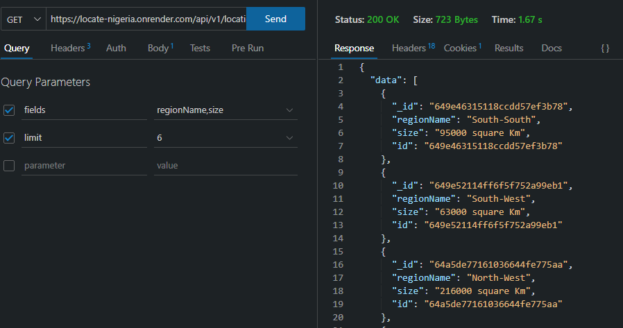

## Locale_API

<a name="readme-top"></a>

<!-- PROJECT SHIELDS -->
<!--
*** I'm using markdown "reference style" links for readability.
*** Reference links are enclosed in brackets [ ] instead of parentheses ( ).
*** See the bottom of this document for the declaration of the reference variables
*** for contributors-url, forks-url, etc. This is an optional, concise syntax you may use.
*** https://www.markdownguide.org/basic-syntax/#reference-style-links
-->
<div align="center">

[![Forks][forks-shield]][forks-url]
[![Issues][issues-shield]][issues-url]
[![linkedin][linkedin-shield]][linkedin-url]

</div>

<!-- PROJECT LOGO -->
<br />
<div align="center">

  <a href="https://github.com/Muyixone/locale_API/tree/main">
    
  </a>

  <h3 align="center">Locale API</h3>

  <p align="center">
   A developer's API that provides geographical information about Nigeria. This API shows you all of Nigeria's regions, states and local government areas. You can also get information about a specific region or state.
    <br />
    <a href="https://locate-nigeria.onrender.com/api-docs/"><strong>Explore the docs »</strong></a>
    <br />
    <br />
    <a href="https://github.com/Muyixone/locale_API/">View Demo</a>
    ·
    <a href="https://github.com/Muyixone/locale_API/issues">Report Bug</a>
    ·
    <a href="https://github.com/Muyixone/locale_API/issues">Request Feature</a>
  </p>
</div>

<!-- TABLE OF CONTENTS -->
<details>
  <summary>Table of Contents</summary>
  <ol>
    <li>
      <a href="#about-the-project">About The Project</a>
      <ul>
      <li><a href="#features">Features</a></li>
        <li><a href="#technologies_used">Technologies Used</a></li>
      </ul>
    </li>
    <li>
      <a href="#getting-started">Getting Started</a>
      <ul>
        <li><a href="#prerequisites">Prerequisites</a></li>
        <li><a href="#installation">Installation</a></li>
      </ul>
    </li>
    <li><a href="#usage">Usage</a></li>
    <li><a href="#contributing">Contributing</a></li>
    <li><a href="#license">License</a></li>
    <li><a href="#contact">Contact</a></li>
    <li><a href="#acknowledgments">Acknowledgments</a></li>
  </ol>
</details>

<!-- ABOUT THE PROJECT -->

## About The Project



<br />

Nigeria as a country has a population of over Two hundred million people (200,000,000) acording 2022 data report from the [world bank](https://data.worldbank.org/country/nigeria), with an anual percentage population growth of 2.4%.

Nigeria is made up of 6 geographical regions, 36 states and over 700 local government areas.

This project is based on providing more information about the country in terms of

- List of all the regions
- Longitude and latitude of each region, as well as population size of each region
- Names of all the states
- Each state can be searched based on the region they belong to
- Each state can be seached based on thier population size
- Local government areas can be searched based on states

In the future, this project has the potential to scale to provdide more information about Nigeria

<p align="right">(<a href="#readme-top">back to top</a>)</p>

### Features

- Access information about Nigeria's regions, states, and local government areas.
- Retrieve detailed information about a specific region or state.
- User registration and API key authentication for accessing public routes.

### Technologies Used

The API is built using the following technologies

- ![Node][NodeJS]
- ![Express][Express.js]
- ![MongoDb][MongoDB]
- ![Redis][Redis]

<p align="right">(<a href="#readme-top">back to top</a>)</p>

<!-- GETTING STARTED -->

## Getting Started

To run this project locally, you need to have a running instance of redis. If you don't have it installed locally, you can visit [Redis installation page](https://redis.io/download/#redis-downloads). You can also install [Redis insight](https://redis.com/redis-enterprise/redis-insight/?_ga=2.107225863.460388105.1689031771-1368251828.1688239450&_gl=1*7nwdxv*_ga*MTM2ODI1MTgyOC4xNjg4MjM5NDUw*_ga_8BKGRQKRPV*MTY4OTAzMTc3MS41LjEuMTY4OTAzMTgzOS42MC4wLjA.) which is a GUI for redis.

### Prerequisites

You need to have a working understaning of Node.js, and also have [Node.js](https://nodejs.org/) installed in your machine's environment

### Installation

_To install and run the Locale API locally, once you have installed the softwares above._

1. Clone the repo
   ```sh
   git clone git@github.com:Muyixone/locale_API.git
   ```
2. Navigate to the project directory
   ```sh
   cd locale_API
   ```
3. Install NPM packages
   ```sh
   npm install
   ```
4. Set up the required enviroment variables

- `.env`
- Add the following environment variables

```js
MONGODB_URI = your_mongodb_uri;
REDIS_USERNAME = your_redis_username;
REDIS_HOST = your_redis_host;
REDIS_PORT = your_redis_port;
REDIS_PASSWORD = your_redis_password;
```

<p align="right">(<a href="#readme-top">back to top</a>)</p>

<!-- USAGE EXAMPLES -->

## Usage

To access the endpoints provided by the Locale API, developers need to register and obtain an API key. The API key is required to access all public routes. Follow the steps below to use the API.

1.  Sign up as a developer/user via the below endpoint

- `/api/v1/user/register`

2. An API key will be given to the developer upon successful registration.


3. Include the API key in the headers of your HTTP requests using the following format

   ```sh
   x-api-key Your_API_KEY
   ```

4. Make HTTP requests to the available endpoints to retrieve the desired geographical information.


_For more examples, please refer to the [Documentation](https://locate-nigeria.onrender.com/api-docs/)_

<p align="right">(<a href="#readme-top">back to top</a>)</p>

<!-- CONTRIBUTING -->

## Contributing

Contributions to the Locale API are welcome! If you find any issues or want to add new features, please submit a pull request. Make sure to follow the existing code style and include relevant tests. Any contributions you make are **greatly appreciated**.

If you have a suggestion that would make this better, please fork the repo and create a pull request. You can also simply open an issue with the tag "enhancement".
Don't forget to give the project a star! Thanks again!

1. Fork the Project
2. Create your Feature Branch (`git checkout -b feature/AmazingFeature`)
3. Commit your Changes (`git commit -m 'Add some AmazingFeature'`)
4. Push to the Branch (`git push origin feature/AmazingFeature`)
5. Open a Pull Request

<p align="right">(<a href="#readme-top">back to top</a>)</p>

<!-- LICENSE -->

## License

Distributed under the MIT License. See `LICENSE.txt` for more information.

<p align="right">(<a href="#readme-top">back to top</a>)</p>

<!-- CONTACT -->

## Contact

For your questions or inquiries, you can contact me

[![twitter][Twitter_shield]][Twitter_url]

Email: muyi.alarezomo@gmail.com

<p align="right">(<a href="#readme-top">back to top</a>)</p>

<!-- ACKNOWLEDGMENTS -->

## Acknowledgments

The following resources where of immence help

- [Build A Jobs API by John Smilga](https://www.youtube.com/watch?v=qwfE7fSVaZM&t=23314s)
- [Understanding API Authentication](https://blog.logrocket.com/understanding-api-key-authentication-node-js/)
- [Node.Js API key authentication](https://www.thecodeforge.io/post/node-js-api-key-authentication)
- [How to implement Caching in Node.JS](https://www.digitalocean.com/community/tutorials/how-to-implement-caching-in-node-js-using-redis)

<p align="right">(<a href="#readme-top">back to top</a>)</p>

<!-- MARKDOWN LINKS & IMAGES -->
<!-- https://www.markdownguide.org/basic-syntax/#reference-style-links -->

[forks-shield]: https://img.shields.io/github/forks/Muyixone/locale_API?style=for-the-badge
[forks-url]: https://github.com/Muyixone/locale_API/network/members
[stars-shield]: https://img.shields.io/github/stars/Muyixone/locale_API?style=for-the-badge
[stars-url]: https://github.com/Muyixone/locale_API/stargazers
[issues-shield]: https://img.shields.io/github/issues/Muyixone/locale_API?style=for-the-badge
[issues-url]: https://github.com/Muyixone/locale_API/issues
[linkedin-shield]: https://img.shields.io/badge/-LinkedIn-black.svg?style=for-the-badge&logo=linkedin&colorB=555
[linkedin-url]: https://www.linkedin.com/in/osamuyialarezomo/
[product-screenshot]: images/screenshot.png
[MongoDB]: https://img.shields.io/badge/MongoDB-%234ea94b.svg?style=for-the-badge&logo=mongodb&logoColor=white
[Redis]: https://img.shields.io/badge/redis-%23DD0031.svg?style=for-the-badge&logo=redis&logoColor=white
[Express.js]: https://img.shields.io/badge/express.js-%23404d59.svg?style=for-the-badge&logo=express&logoColor=%2361DAFB
[NodeJS]: https://img.shields.io/badge/node.js-6DA55F?style=for-the-badge&logo=node.js&logoColor=white
[Twitter_shield]: https://img.shields.io/badge/Twitter-1DA1F2?style=for-the-badge&logo=twitter&logoColor=white
[Twitter_url]: https://twitter.com/Muyixone
[Gmail_shield]: https://img.shields.io/badge/Gmail-D14836?style=for-the-badge&logo=gmail&logoColor=white
[Gmail_url]: muyi.alarezomo@gmail.com
